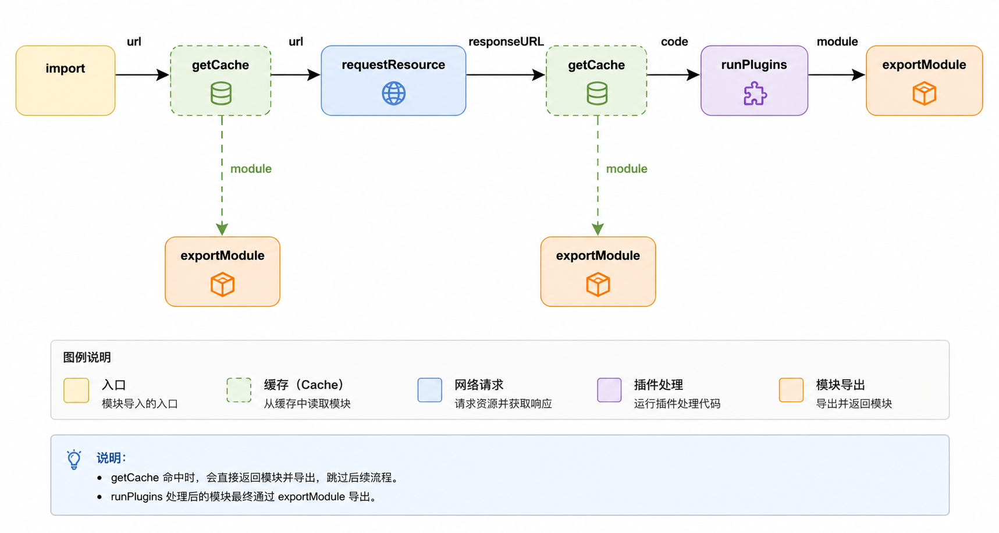

# 模块加载器

前段时间系统性地看了一遍模块加载相关的内容，顺手写了一个实验性质的实现：[liberty](https://github.com/imtaotao/liberty)。它的目标很明确，就是在浏览器端模拟出一套“类 CommonJS”的模块加载体验。

这篇文章主要记录实现思路，免得以后把这些细节忘掉。

## 我想得到的最小能力集合

如果想模拟 CommonJS，最基本的几样东西不能少：

- `require`
- `module`
- `exports`
- `__filename`
- `__dirname`

其中最关键的一点是：`require` 返回的模块最好保持同步语义，这样用起来才真正像 CJS。

## 最初的设计很简单

起步时我给自己定的思路只有四步：

1. 拿到文件源码
2. 在一个隔离环境里执行模块代码
3. 缓存模块
4. 以 URL 作为唯一标识，保证同一个模块只执行一次

一开始我基本就是按这条线推进的。后面为了处理更多实际问题，细节才越来越多。下面是模块加载的大概流程。




## 为什么不是直接插 `script`

一个直觉上的问题是：既然浏览器本来就能通过 `script src` 加载脚本，为什么还要先取源码、再自己执行？

原因在于我想加一层插件系统，让源码在执行前有机会被实时转换。换句话说，这个加载器不仅要“拿到代码”，还要“有机会修改代码”，这时直接插 `script` 就不够用了。

当然，这种实现并不以安全性为目标。这里讨论的是原理，不是生产级隔离沙箱。

## 整体流程

模块的大致流转过程可以概括成下面这样：

```text
url -> getCache -> requestResource -> getCache -> runPlugins -> exportModule
```

如果展开一点看，它真正做的事情无非是三段：

- 先判断缓存里有没有结果
- 没有的话就请求资源
- 拿到资源后交给插件系统转换，再返回最终模块结果

## 同步加载和异步加载要统一入口

入口函数我当时是这样组织的：

```ts
function importModule(path, parentInfo, config, isAsync) {
  const envPath = parentInfo.envPath;
  const pathOpts = realPath(path, parentInfo, config);

  if (cacheModule.has(pathOpts.path)) {
    const Module = cacheModule.get(pathOpts.path);
    const result = getModuleResult(Module);

    return !isAsync ? result : Promise.resolve(result);
  }

  return isAsync
    ? getModuleForAsync(pathOpts, config, envPath)
    : getModuleForSync(pathOpts, config, envPath);
}
```

核心点在于：同步和异步只是结果返回形式不同，真正的资源定位、缓存判定、模块执行流程应该尽量共用。

## 缓存不止一层

这个加载器里实际用了三类缓存：

- `modulesCache`
- `responseURLModulesCache`
- `resourceCache`

前两个缓存的都是模块结果，差别在于 key 不一样。

### 为什么要有两个模块缓存

如果只用用户传进来的 URL 当 key，那么同一份资源只要换一种路径写法，就可能被当成两个模块重复执行。

为了尽量避免这个问题，路径规范化是第一步，所以实现里会借用一些类似 Node.js `path` 模块的能力：

- `path.normalize`
- `path.isAbsolute`
- `path.join`
- `path.dirname`
- `path.extname`

但光有规范化还不够。因为真实请求过程中，URL 还可能经历重定向，所以最终又加了一层 `responseURL` 级别的缓存，尽量用服务端真正返回的资源地址来兜底。

## 插件系统怎么设计

插件接口本身可以很简单：

```ts
Liberty.addPlugin('.js', fn);
```

实现上，每一种文件类型维护一个插件集合。资源拿到以后，按顺序把它们喂给对应的插件，让上一个插件的输出成为下一个插件的输入。

```ts
class Plugins {
  constructor(type) {
    this.type = type;
    this.plugins = new Set();
  }

  add(fn) {
    this.plugins.add(fn);
  }

  forEach(params) {
    let res = params;

    for (const plugin of this.plugins.values()) {
      res.resource = plugin(res);
    }

    return res;
  }
}
```

再往上套一层 `Map`，负责按扩展名管理这些插件实例：

```ts
const map = {
  allPlugins: new Map(),

  add(type, fn) {
    if (!this.allPlugins.has(type)) {
      const pluginClass = new Plugins(type);
      pluginClass.add(fn);
      this.allPlugins.set(type, pluginClass);
    } else {
      this.allPlugins.get(type).add(fn);
    }
  },

  get(type = '*') {
    return this.allPlugins.get(type);
  },

  run(type, params) {
    const plugins = this.allPlugins.get(type);
    return plugins ? plugins.forEach(params) : params;
  },
};
```

对我来说，这套设计最重要的不是“功能多强”，而是足够清楚：核心加载流程只负责调度，真正的内容转换交给插件。

## JavaScript 模块怎么执行

对 `.js` 文件，最终还是要落到“如何执行源码”这一步。

在 Node.js 里，类似能力可以借助 `vm.runInThisContext`：

```ts
const result = vm.runInThisContext(code, {
  filename: 'xx.js',
  displayErrors: true,
});
```

但浏览器没有这套 API，所以只能在下面几种方案之间选：

- `eval`
- `new Function`
- 动态插入 `script`

`eval` 直接排除，成本和可维护性都不理想。`new Function` 比 `eval` 好一些，但我并不想让全部模块都走这种路径。最后采用的是动态创建 `script` 标签同步执行代码，再结合 sourcemap 辅助定位源码。

## 执行前要先包一层作用域

每个模块都应该有自己的私有作用域，所以最直接的方式就是把源码包进一个自执行函数里，并把 CJS 需要的变量注入进去。

```ts
const params = Object.keys(registerObject);
const randomId = Math.floor(Math.random() * 10000);
const windowModuleName = '__rustleModuleObject' + randomId;

let scriptCode =
  `(function (${params.join(',')}) {` +
  `\n${basecode}` +
  `\n}).call(undefined, window.${windowModuleName}.${params.join(
    `,window.${windowModuleName}.`,
  )});`;
```

再准备一份注入对象：

```ts
const Module = { exports: {} };
const parentInfo = getParentConfig(path, responseURL);

const require = (path) => importModule(path, parentInfo, config, false);
require.async = (path) => importModule(path, parentInfo, config, true);
require.all = (paths) => importAll(paths, parentInfo, config);

const registerObject = {
  require,
  module: Module,
  exports: Module.exports,
  __filename: responseURL,
  __dirname: parentInfo.dirname,
};
```

最后执行：

```ts
const node = document.createElement('script');
node.text = scriptCode;

window[windowModuleName] = registerObject;
document.body.append(node);
document.body.removeChild(node);

delete window[windowModuleName];
```

## 为什么执行前就要缓存

这点非常关键：缓存不能等执行结束后再写入，而要在执行前先占位。否则一旦出现循环引用，整个行为就和 CommonJS 不一致了。

```ts
cacheModule.cache(path, registerObject.module);
responseURLModules.cache(responseURL, registerObject.module);

run(scriptCode, registerObject);

cacheModule.clear(path);
responseURLModules.clear(responseURL);
```

当然，执行失败后要及时清理缓存，避免下次命中错误状态。

## 插件系统还能做什么

一旦插件机制建立起来，JavaScript 就只是其中一种处理对象。比如：

### JSON 自动解析

```ts
const JSONPlugin = (res) => JSON.parse(res.resource);

Liberty.addPlugin('.json', JSONPlugin);
```

### CSS Module、SFC 等更多扩展

同样的思路也可以继续延伸到 CSS、Vue 单文件组件等资源格式。核心加载器并不需要理解这些内容，它只负责把资源交给对应插件。

## `resourceCache` 是干什么的

理解 `resourceCache`，得先区分“静态资源”和“模块结果”。

- 静态资源是通过请求拿到的文件内容
- 模块结果是资源经过插件系统处理之后的产物

在 CommonJS 环境里，我们更习惯关注模块缓存；但如果放到浏览器里，为了处理同步语义、依赖预取和性能问题，资源本身也值得缓存。

## 同步加载为什么困难

浏览器里真正麻烦的地方不在模块系统本身，而在“同步拿到资源”这件事上。

### 直接用同步 XHR 并不可取

理论上可以，但问题很明显：

- 它会阻塞主线程
- 模块一多，体验会非常差
- 同步 XHR 已经被标准废弃

### ESM 给了一个启发

ESM 的一个关键特点是静态化。依赖关系可以在运行前分析出来，所以浏览器能先把资源准备好，再执行代码。

这给了一个很直接的启发：如果能够提前分析依赖、提前缓存资源，那么浏览器端的同步风格加载并不是完全没机会模拟。

例如下面这种纯字符串 `require`，理论上就能被提前检测：

```ts
require('/dev/a.js');
require('/dev/b.js');
```

但运行时动态拼接路径就很难静态分析了：

```ts
const urls = ['/a.js', '/b.js'];
urls.forEach((v) => require('/dev' + v));
```

## 还有 HTTP 层面的限制

在 HTTP/1.1 下，即便允许多个 TCP 连接并发，请求数也依然有限。常见场景下同时并发连接数只有几条，这意味着模块粒度、切分策略和请求调度都会影响整体体验。

如果放到 HTTP/2，多路复用能缓解很多问题，这也是为什么加载策略一定要结合具体运行环境来看。

## Sourcemap 也是这个系统里很重要的一环

既然模块代码经过了包装、拼接甚至转换，那么调试时就必须把错误尽量映射回原始源码位置。否则运行虽然通了，开发体验会非常糟糕。

这部分如果继续深入，其实又能单独展开成一篇文章。

## 总结

这个模块加载器本质上是在浏览器里重做一遍“资源获取、模块执行、结果缓存、插件转换”的流程。难点从来不只是“把代码跑起来”，而是在同步语义、缓存精度、扩展性和调试体验之间取平衡。

它当然还有很多不完善的地方，但至少把几个关键问题都摆到了台面上：

- 怎么统一同步和异步加载
- 怎么降低重复执行风险
- 怎么把内容转换能力从核心里抽离出来
- 怎么在浏览器里模拟接近 CJS 的体验

对我来说，这种实验的价值就在这里。
