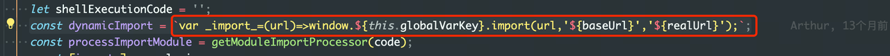
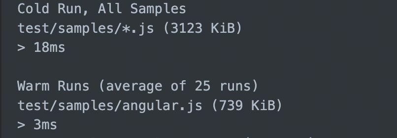
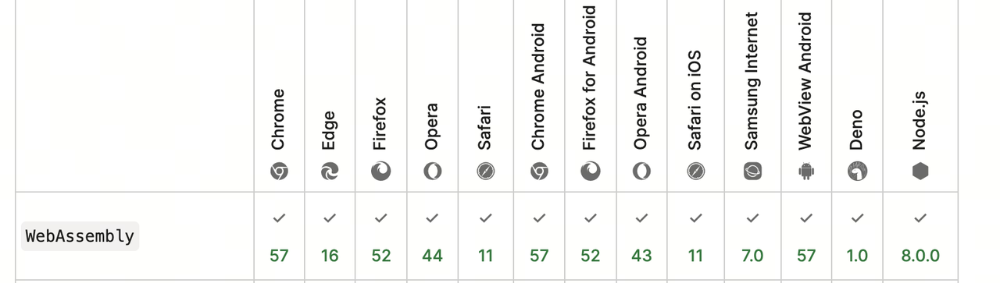
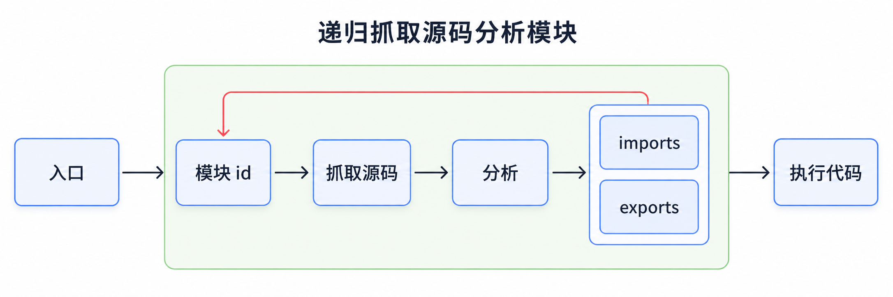
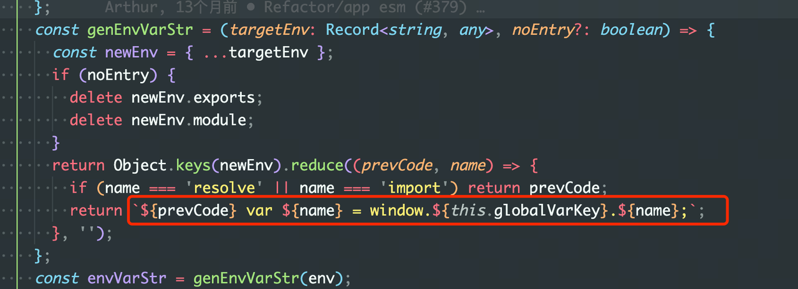

由于 Garfish 的子应用渲染模式以及环境变量注入这一个很重要的特性，导致与浏览器的 esm 兼容是比较困难的，但是最近会有很多的打包工具，例如 vite，都是必须要使用 esm，甚至生产环境中都会用到 esm。本篇文档会讨论介绍不带沙箱或者只带快照沙箱情况下的实现方案。

## Garfish 是如何执行代码的

Garfish 会创建一个 function，来将子应用的 js 代码包裹起来，这样的好处是代码的执行不会污染外部环境，并能注入一些环境变量，这块的灵感来自于 NodeJS。用代码来表示如下：

> 至于为什么要用 eval，而不是 new function，那就是另外一个解决 sourcemap 的话题了。

```ts
const evalInfo = [
  `;(function(${keys.join(',')}){${useStrict ? '"use strict";' : ''}`,
  `\n}).call(window.${contextKey},${values.join(',')});`,
];

const code = evalInfo[0] + code + evalInfo[1];
eval(code);
```

通过上面的伪代码可以看到，我们多包一层 function，那就代表着在运行时多了一层 scope，恰恰是这层 scope，导致了 esm 的代码无法被执行。esm 的 import 和 export 是只能在顶层作用域使用的，所以我们必须改变我们的实现。

## 方案设计

因为没有考虑 vm 沙箱，我们要实现的功能主要是以下几种：

- 不会污染全局作用域
- 能够注入环境变量

esm 自带一个 module 作用域，这个就和我们自己构建一个 function 类似，所以也不会污染全局作用域，所以我们只要能够解决环境变量的注入问题就解决了。

## Case 对比

传统的方式，环境变量是通过 function 参数的方式注入进去的，参数和本地的 var 声明是比较像的，在 es 的标准规范上，他们同属于一个 scope，并且都是可变的，并且允许重复声明。比如有以下几个 case 可供思考：

### 允许重复赋值

<Columns title="function 参数注入 vs module 作用域" columns={2}>
  <Column title="function 参数注入">

```js
function vm(env) {
  // 框架注入的代码
  console.log(env);
  env = 2; // 是可变的
  console.log(env);
}

// 全局作用域
console.log(env); // throw error
```

  </Column>
  <Column title="module 作用域">

```js
// module
var env; // 框架注入的代码
console.log(env);
env = 2; // 是可变的
console.log(env);

// global code
console.log(env); // throw error
```

  </Column>
</Columns>

### 允许重复声明

如果重复声明换成 let 和 const，都会报重复声明的错误，这两点的行为上也是一致的。

<Columns title="重复声明行为对比" columns={2}>
  <Column title="function 参数注入">

```js
function vm(env) {
  // 框架注入的代码
  console.log(env); // 1
  var env = 2;
  console.log(env); // 2
}

vm(1);
```

  </Column>
  <Column title="module 作用域">

```js
var env = 1; // 框架注入的代码
console.log(env); // 1
var env = 2;
console.log(env); // 2
```

  </Column>
</Columns>

## 模块加载流程

我们知道 esm 的语法是同步的，也就是说，开发者在使用的过程中是无法感受到 js 文件加载的，浏览器对 esm 的处理的流程如下：



可以看到，浏览器会先去根据入口分析所有的模块信息，并去抓取对应的 js 文件，然后才会去执行代码。由于 js 属于动态类型的语言，如果像 cjs 一样，模块信息需要运行时的计算，就没法在浏览器里面同步使用，所以才需要定义 esm 只能在顶层作用域，而且偏向静态语法，defer 属性也失效。

所以我们也需要走同样的流程，去分析加载模块文件，然后将源码进行拼接，注入环境变量。

## 实现步骤

### 1. 如何分析模块

和以前做 cssParser 和 htmlParser 一样，我们不太可能通过写一个正儿八经的 parser，分析完整的 ast 来拿到模块导入导出信息，因为在运行时这样做，性能是非常差的，但是浏览器并没有像 html 和 css 一样有一个可以用的 api。

所以得想其他办法，经过调研，有以下两种实现：

<Columns title="模块分析方案对比" columns={2}>
  <Column title="正则匹配">

通过正则匹配出 `import xx from 'module'`。

第一版实现基于正则：[代码链接](https://github.com/modern-js-dev/garfish/pull/379/files#diff-0ff65db2ad88fa500108823f8013dcdb03cb54658a1ed0e13c2c2d0646894cd5)

  </Column>
  <Column title="es-module-lexer">

社区有一个 wasm 写的库可以做到这个事情，vite，umi 等开源工具也在用。

https://github.com/guybedford/es-module-lexer

  </Column>
</Columns>

最终选择 wasm 的 parser 而不是正则来实现，原因主要有以下几点：

<Columns title="选择 wasm parser 的原因" columns={3} gap="sm">
  <Column title="上下文更可靠">

正则匹配没有上下文，导致模板字符串的语法匹配不上，例如：

```js
// 这会导致我们没法区分 log，
// 或者字符串中的 import 文本，
// 则会得出错误的 import 信息
console.warn(`import('${x + fn()}.js')`);
```

  </Column>
  <Column title="性能更好">

Wasm 版本的 esm parser 性能很好。



  </Column>
  <Column title="兼容性可接受">

从兼容性考虑，wasm 出现的时间比 esm 更早，所以浏览器支持了 esm 的基本上也能支持 wasm（个别例外）。



  </Column>
</Columns>

所以分析出模块的导入导出信息就不成问题了。

```ts
const [imports] = parse(code, url);
console.log(imports);
```

### 2. 递归请求抓取文件源码

当我们确定了分析单一模块信息的方案后，我们就可以根据递归来抓取所有的文件源码（如上面的流程图所示），当所有的源码都抓取完毕后，我们就能够去修改源码，拼接注入环境变量的代码。



### 3. 环境变量的注入

当我们抓取到源码后，我们就可以编译源码，最后我们将主框架传入和定义的环境变量通过 var 来声明在模块的最顶部，这样更改后的源码才是最终运行的代码，下面是源码的实现。



### 4. 模块 id（url）的处理

当我们编译完所有的模块后，我们就需要将模块 id 改为我们编译后的模块，所以必须要有一个机制让我们能够 import 编译后的 url。经过调研后，我们选择使用 URL.createObjectURL 这个 api，用于创建 URL 的 File 对象、Blob 对象或者 MediaSource 对象，而且原生的 esm 也是支持的。例如下面的代码：

<Columns title="模块 id 替换前后" columns={2}>
  <Column title="源码">

```js
// 源码
import { m } from './a.js';
```

  </Column>
  <Column title="编译后">

```js
var env1 = 'xx';
var env2 = 'xxx';
import { m } from 'blob:null/9eadfd5a-67c8-4550-a0ab-d1489116574b';
```

  </Column>
</Columns>

```ts
// Garfish 内核创建 URL 的方法
const createBlobUrl = (code: string) => {
  return URL.createObjectURL(new Blob([code], { type: 'text/javascript' }));
};
```

### 5. Sourcemap 的处理

Sourcemap 的处理需要计算行与列的相对位置，并生成对应的标记，由于完整的 sourcemap 生成也是需要分析 ast 的，而且 ast 需要带原坐标和转换后的坐标才能做。我们这里并没有 ast 可供分析，但是我们的场景处理是有特殊性的。

- 我们只是在最顶上补了一行
- 只改变了 moduleId 的命名

针对第一种情况，我们只需要固定的将 sourcemap 的行往上提一层就好了，第二种情况，由于 import 的声明是静态的，所以不太可能有其他的信息输出，所以大部分场景下可以不用管（极端场景就另说了）。那么我们的处理如下就可以了：

这里的 C 表示相对行数，意思是相对上一个是第二行。

```ts
export async function createSourcemap(code: string, filename: string) {
  const content = await toBase64(
    JSON.stringify({
      version: 3,
      sources: [filename],
      sourcesContent: [code],
      mappings:
        ';' +
        code
          .split('\n')
          .map(() => 'AACA')
          .join(';'),
    }),
  );
  return `//@ sourceMappingURL=${content}`;
}
```

### 6. 动态 import 等处理

上面的一些环境介绍分析了静态 import 的处理，但是还有动态的 import 和 import.meta.url 需要修复。动态的 import 引用的 moduleId 也是需要我们替换为编译后的 moduleId，而且 import.meta.url 也是编译后的 URL，这是不符合要求的，也需要修正。

- import.meta.url 的修正

```js
// 我们在最前面将 import.meta.url 进行修改就行了
compileCode = `import.meta.url='${originUrl}';${originCode};`;
```

- 动态 import 的修改，内置一个 `_import_` 方法。


```js
// 将代码中的 import 替换为 _import_
const dynamicImportStatement = code.slice(start, end);
compileCode += dynamicImportStatement.replace('import', '_import_');
```

这样就可以将动态的 import 和静态的 import 抹平了。

## 总结

在上述方案中，我们大致的描述了整体的思路，并对一些方案的选择做了一些判断和调研，总体上来说，效果还不错，在 vite 等场景下，跑的比较流畅，也是为微前端和更现代的打包开发工具的结合提供了社区范例。
