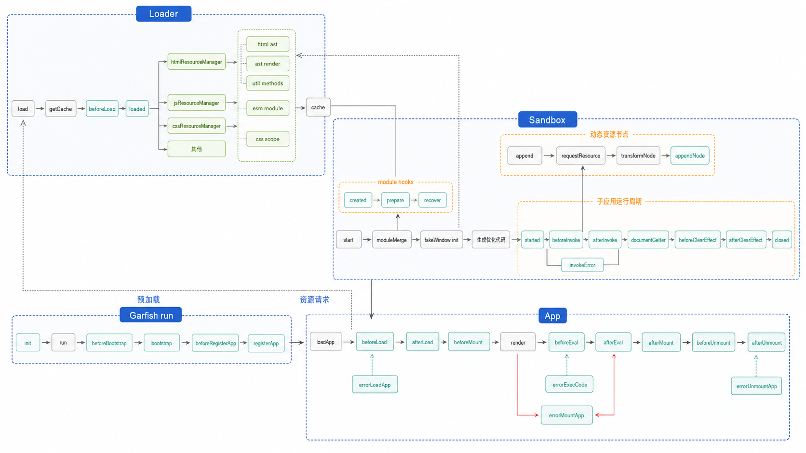

Garfish 迭代到现在（2022.08）和最初的版本相比已经完全不同了。本篇文档不会讲微前端的应用场景和带来的价值，而是专注于框架本身，从远距离的视角讲述整体的设计思想、核心的渲染流程、VM 沙箱的核心设计和插件机制。

最后会写几个 demo 插件，演示如何根据自己的业务深度定制化改造 Garfish。

## 起源

头条号是一个发文站点，它有多个子系统，包括发文、音频等。有些子系统由头条团队维护开发，有些子系统由西瓜团队维护开发。所以微前端这门技术应运而生，主要由两部分组成：

- runtime 框架
- 部署平台

2018 年第一个 commit 提交了，并命名为 garr。在 2020 年年中的时候，garr 启动了重构计划，runtime 框架完全重构，部署平台迁移到了 goofy，并重命名为 Garfish，这也就是现在开源的版本。

## 微内核架构的底子

Garfish 的核心架构其实就是微内核架构。大家可以提前思考一下：应该如何设计这个框架？可以大胆假设场景，这套架子对于插件定位和插件编写来说很重要。

### 前提假设

#### 1. 浏览器中的网页接入标准很低

一个新手从 0 开始学习，在很短的时间内就能入手写一个网页。他不需要有工程化思想，也不需要组件化等技术。

作为一个微前端技术，你就得考虑是否要和浏览器的这些开发思想进行对齐。即使它不是那么好，有历史负担，也必须承认：处理这些历史兼容性，是降低用户入门门槛、扩展框架适用范围的较好选择。

#### 2. 如何处理千奇百怪的业务需求

有一个特性大家写过 React 的都应该比较了解，那就是 `useEffect`。这个钩子出现的原因在于，function component 理论上应该是纯的，例如下面的表达式：

```txt
view = render(state)
```

这是一种有着数学公式般的简洁与美的逻辑思考方式。但正如数学之于物理，必须承认的是，现实生活不可能做到这样完美，我们有太多未知的、不可预料的行为出现。

基于这种认识，那必然要有一种手段处理这些不可预料的行为。不如改个名字，相对于纯逻辑，叫它们副作用如何？

### 架构概念

#### 大而全的超强内核（整体性核心）

所有的副作用内聚到框架核心，框架核心做到方方面面的兼顾。

好处是开箱即用，上层用户的成本会少很多，可以基于稳定强大的内核很轻易地做事情（点名 Jupiter）。

坏处是核心底层的实现需要足够强大，因为牵一发而动全身，而且整体会比较黑盒。但是我们在上面说过，现实世界的需求近乎无限，这需要庞大且高水平的人力资源来开发维护。

#### 小而美的精致内核（微核心）

假如不可避免又不愿意处理这些杂而乱的副作用，应该怎么做？是否可以抛到外层，交由上层应用自行处理：谁的业务需求，谁自己处理？

此时只要保证内核很纯粹地处理核心逻辑即可。为此，需要设计出一套机制，让上层应用来处理副作用。内核只做最核心的事情，并在各个关键接口进行广播，这也就是 Garfish 有那么多钩子的由来。

这样做的好处是彻底解放了内核，也给了上层应用很大的自由扩展权限。坏处是需要对这种自由进行限制，因为上层对接层（Garfish 中就是插件）很难感知到对方的存在，这必然会带来性能浪费。

举个例子，现在需要一段纯数据，然后每个插件都逐一使用，每个插件彼此独立、互不知晓：

```txt
原始输入：[1, 2, 3]
插件 A：计算倍数得到 [3, 6, 9]
插件 B：计算倍数，然后再加 1，得到 [4, 7, 10]
```

但是为了彻底独立 A 和 B，插件 B 只能利用原始数据，不能利用插件 A 的计算结果。

#### 混合内核

整体性的内核和微内核都有缺陷，所以混合内核就是两种模式的结合体。

这里再举一个真实的例子。如果大家写过 webpack 插件，就会知道 webpack 内置了一份 JS 源码的 AST，它使用 acorn 来解析。原因在于 JS parse 是一个非常耗时的操作，但是在模块打包的过程中，有非常多的场景都需要分析源码的 AST。

将一部分高优、费性能、与核心逻辑无关的模块抽到核心内核中用来提升性能，这就带有整体性核心的思想了。所以 Garfish loader 就内置到了 Garfish 实例上，因为对一些资源的预处理都在这里面，可以供核心插件和用户自定义插件使用。

### 小结

现在一直在思考尝试去总结出需要内置到核心内核的模块，但是还没有办到，所以插件机制开放出去，可能造成混乱的生态，导致性能低效到爆炸（点名 webpack）。

growth 这边对微前端的应用可以有很多插件实验场景，从业务中总结出来会更好。

由于微前端所处的 Web 环境非常复杂，DOM、BOM 相关的 API 非常多，而且受限于浏览器这个沙箱环境，做事情很受限。结合前期 Garfish 投入开发的人力也不是很多，所以微内核架构是一个不错的选择。

## 调研

我们调研了一些社区里使用到微内核架构的作品，以及插件的 API 语法设计。主流框架插件体系这里简单举几个例子。

### webpack

Webpack 对模块的处理，微内核的设计主要有两大块：

- loader 机制
- plugin 机制

loader 是一种责任链机制的微内核，满足逐层处理的情况，对于源码处理很符合这个场景。Garfish 对 loader 资源的处理就是责任链机制。

插件是一种生命周期机制，在一个完整的处理周期内对关键节点进行广播，开放接口。这对于深度定制化的需求很有帮助，所以 webpack 的钩子很多。

### Rollup

Rollup 使用插件语法：

```js
function pluginExample(opts) {
  return {
    name: 'rollup-plugin-name',
    load() {
      // ...
    },
  };
}
```

Rollup 也有很多钩子，会在整个构建流程里对关键节点进行广播。而 Garfish 就借鉴了和 Rollup 相似的语法。

## Garfish 的核心流程

下面是核心渲染流程和核心插件流程。



这里的 VM 沙箱中，默认 modules 有以下几个：

- `document`
- `eventListener`
- `history`
- `mutationObserver`
- `network`
- `storage`
- `timer`
- `uiEvent`

## 环境变量

本小节介绍环境变量，因为在插件之中，可以借助环境变量在各个应用中进行通信。环境变量一般都是通过宿主环境来注入的。

### 普通模式下的环境变量注入

环境变量的注入涉及代码是如何执行的。在现阶段的 JS 标准里，对于代码执行，主要有两种方式：

- `new Function`
- `eval`

这里举一个例子，在 NodeJS 里面有几个常用的环境变量：

```js
(function (__dirname, __filename, module, exports) {
  // Node.js 代码
})(...);
```

所以，在 Garfish 里面，也是通过这种语法来注入的。例如常见的 `__GARFISH_EXPORTS__`：

```js
window.xx.exports = {};

eval(`(function(__GARFISH_EXPORTS__) {
  // ...
})(window.xx.exports)`);
```

### ES Module 下的环境变量注入

在 ESM 中，这些模块的导入是无法在次级作用域中执行的。上述方案是行不通的，所以不能以 function 的方式注入。但是我们可以用下面这种语法：

```js
// 源码
import m from 'module';
console.log(__GARFISH_EXPORTS__);

// 添加环境变量之后
var __GARFISH_EXPORTS__ = window.xx.exports;
import m from 'module';
console.log(__GARFISH_EXPORTS__);
```

我们将环境变量保存在 `window` 上的一个特殊属性中，然后对源码进行更改。

这样做之后是否还有问题？当然是有的。在普通模式中，我们是通过 `eval + function` 来执行代码。但是在 ESM 模式下这样不行，所以我们会用下面这样的语法：

```js
// x.js 就是一个 esm 的入口，一般是由带 type="module" 的 script 标签声明的
import('./x.js');

// 实际上源码中的写法是，避免被打包
eval(`import('./x.js')`);
```

这会让整个依赖链都交由浏览器自己处理，导致我们没有机会对源码做更改和注入环境变量。所以得换个思路来处理：

1. 从入口脚本开始分析，所有的模块资源都由我们自己抓取。
2. 所有脚本都会经过编译，包括环境变量注入和模块名更改。
3. 编译后的脚本存在内存中，并以 `data:` URL 的语法导入。

### data URL

JS 标准没有规范平台需要支持的 URL scheme（protocol），这全交由平台自己的选择和实现。浏览器和 NodeJS 都支持 `data:` URL（base64 也一样）。

所以我们可以依赖这个特性做虚拟文件系统，内联 ESM 脚本、内联 worker 脚本都是可以的。

```js
// 例如 inlineWorker
function inlineWorker(fn) {
  const fnBody = fn
    .toString()
    .match(/^function\s*\w*\s*\([\w\s,]*\)\s*{([\w\W]*?)}$/)[1]
    .trim();
  const url = URL.createObjectURL(
    new Blob([fnBody], { type: 'text/javascript' }),
  );

  return new Worker(url);
}

const worker = inlineWorker(function () {
  console.log(self);
});
```

所以最终所有模块 import 其他模块时，都是下面的语法，而且我们也会修正像 `import.meta.url` 这种环境变量。

```js
import m from 'data:xxx';
```

最初的实现是通过正则表达式来实现模块编译，但是正则没法解析模板字符串，所以一些边界 case 没法解决。后来走正儿八经的 parser，主要用的是 `es-module-lexer` 这个包。虽然 star 不多，但是被很多其他重要的框架使用，例如 Vite、Umi，NodeJS 源码中也模仿它写了一个 CJS 的模块分析包。因为它够简单、够稳定、够快，3M 的文本分析仅 18ms。

### 自定义环境变量

例如在 `appRuntime` 之中，我们就需要通过环境变量来做一套通信机制。

```js
// 插件编写
function CustomEnvPlugin(customEnvs) {
  return {
    name: 'customEnv',
    beforeLoad(appInfo, app) {
      app.vmSandbox.hooks.usePluing({
        name: 'customEnv',
        beforeInvoke(codeRef, url, env) {
          Object.assign(env, customEnvs);
        },
      });
    },
  };
}

// 使用
Garfish.usePlugin(CustomEnvPlugin, {
  tao: 123,
  require: (moduleId) => {
    // 这里就可以重写 Garfish externals 的机制
    if (moduleId === 'react') {
      return 1;
    }
  },
});

// 子应用代码
console.log(tao); // 123
import React from 'react';
console.log(React); // 1
```

## Loader 与子应用的请求隔离

对子应用网络请求的处理主要分为两块：

- `Garfish.loader`：子应用的资源加载处理都是通过这个 loader。
- 子应用内部请求：子应用内部自己发起的 `xhr`、`fetch`、`websocket` 等请求。

### loader

Loader 主要用来请求所有的子应用资源，并做一些额外的处理和缓存。例如 HTML 模板会被 parse 成一份 AST 结构，以便供内核和其他插件内部分析。

它主要有两个钩子：`beforeLoad` 和 `loaded`。

例子：Garfish 默认只支持 HTML entry 和 JS entry，但是我们可以对插件做更改以支持 img entry。

```js
function ImgEntryPlugin(Garfish) {
  const name = 'ImgEntryPlugin';

  // 允许 img entry
  const processImg = (data) => {
    const code = ``;
    const manager = new Garfish.loader.TemplateManager(code, data.result.url);

    data.value.code = code;
    data.value.fileType = 'template';
    data.value.resourceManager = manager;
  };

  Garfish.loader.hooks.usePlugin({
    name,
    beforeLoad(data) {
      // 请求子应用的资源时，添加自定义的 header
      data.requestConfig.header.xx = 'xx';
      return data;
    },
    loaded(data) {
      // 拿到子应用模板的 ast 结构，然后可以修改，最终会渲染出来
      // 实际上 Garfish 核心的渲染逻辑也是对这份 ast 分析渲染的
      console.log(data.value.resourceManager.astTree);

      // 支持 img entry
      if (data.value.url.endsWith('.jpg')) {
        processImg(data);
      }

      return data;
    },
  });

  return { name };
}

// 使用方法
Garfish.usePlugin(ImgEntryPlugin);
Garfish.loadApp(name, {
  entry: 'https://xx.jpg',
  domGetter: () => document.body,
}).then((app) => app.mount());
```

同样的，可以自由扩展多种 entry，比如 pdf、audio、video，和浏览器对齐。

### 子应用内部的请求

VM 沙箱会重写 `xhr`、`fetch` 和 `websocket`，并修正 URL，所以可以对它们进行更改重写。

假如子应用的所有请求在原来的应用中没有跨域，所以不会带上 `credentials` 配置。但是迁移到微前端后出现了跨域场景，而子应用很大，很难去修改业务代码。

```js
const networkModule = () => {
  return {
    created(fakeWindow) {
      if (fakeWindow) {
        const OriginXHR = fakeWindow.XMLHttpRequest;

        fakeWindow.XMLHttpRequest = class XMLHttpRequest extends OriginXHR {
          send(...args) {
            // 添加 withCredentials 属性
            this.withCredentials = true;
            return super.send.apply(this, args);
          }
        };
      }
    },
  };
};

const GarfishNetworkFix = () => {
  return {
    name: 'GarfishNetworkFix',
    bootstrap(options) {
      const { sandbox } = options;

      if (sandbox && !sandbox.snapshot) {
        sandbox.modules = sandbox.modules || [];
        sandbox.modules.push(networkModule);
      }
    },
  };
};
```

## Garfish 插件编写案例

上面几个小节介绍了一些核心的调度和环境变量，已经覆盖了大部分流程。所以我们可以尝试写几个插件。

### 白名单 localStorage

`localStorage` 是默认隔离的，我们可以将 `localStorage` 设置成全局的，避免隔离，共用一套。但其实也可以做白名单，避免全部被隔离。

```js
function StorageWhitelistPlugin(Garfish, list) {
  const rewrite = (storage) => {
    const { rawStorage } = storage;

    const realKey = (name) => {
      // 如果在白名单中就不加前缀，否则就加前缀隔离
      return list.includes(name) ? name : `${storage.prefix + name}`;
    };

    storage.getItem = function (key) {
      return rawStorage.getItem(realKey(key));
    };

    storage.setItem = function (key, value) {
      return rawStorage.setItem(realKey(key), value);
    };

    storage.removeItem = function (key) {
      return rawStorage.removeItem(realKey(key));
    };

    return storage;
  };

  const modifyVmSandboxStorage = () => {
    return {
      created(fakeWindow) {
        // 在子应用的沙箱初始化好了之后，重写他们的 localStorage
        fakeWindow.localStorage = rewrite(fakeWindow.localStorage);
        fakeWindow.sessionStorage = rewrite(fakeWindow.sessionStorage);
      },
    };
  };

  return {
    name: 'StorageWhitelistPlugin',
    beforeLoad(appInfo) {
      // 在子应用加载之前，对 appInfo 进行修改
      const { sandbox } = appInfo;

      if (sandbox && !sandbox.snapshot) {
        sandbox.modules = sandbox.modules || [];
        sandbox.modules.push(modifyVmSandboxStorage);
      }
    },
  };
}

// 使用
Garfish.usePlugin(StorageWhitelistPlugin, ['chentao']);
```

上面写的这些插件，里面用到的接口都是对外开放的。也就是说，在 v6 这个大版本里面是肯定不会改动的，除非整个架构都有调整。
