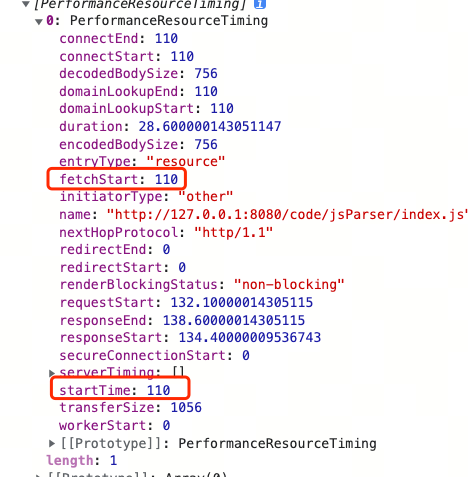
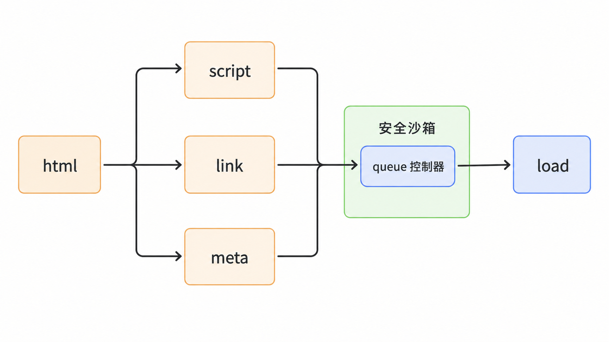

由于一个主体应用中经常会存在多份子应用，当浏览器处于空闲时刻时，我们可以提前加载这些子应用的资源，并提前处理。

这样就可以减少其他子应用的加载时长，从而提升渲染性能，这也是 Garfish 需要提供的一个很重要的能力。

## 思路和调研

对于预加载的实现，有几个点是受到限制的：

- 希望不影响页面正常的网络请求，所以需要寻找监听网络空闲事件的 API。
- 需要知道哪些资源被预加载。

### 1. 寻找网络空闲 API

浏览器提供了一个 `requestIdleCallback`，这个 API 是用来监听浏览器空闲时间的，可以用来运行高耗时、低优先级的事情。

同理，预加载也是高消耗、低优先级的事情，只不过它的消耗主要发生在网络层面。

#### Service Worker

实际上，浏览器并没有一个叫 `networkIdleCallback` 的 API 可供我们使用。在最开始的时候，我们找到一个类似的库：<GitHubRepo repo="pastelsky/network-idle-callback" />。

但是它强依赖 Service Worker。Service Worker 确实能够监听所有网络请求，这样就能计算出什么时候是空闲的，但是这也会对业务造成强侵入。如果把它内置到内核之中，会是一种很脏的实现。

#### PerformanceObserver

当选择放弃 Service Worker 时，则需要另外一种方式来实现。

浏览器有一个叫 `PerformanceObserver` 的 API，它主要是记录一些资源的耗时。换一个角度说，当资源结束请求时，会触发回调。如果能够知道这个请求是什么时候开始的，那就能完整记录一个请求的活动过程，自然也就能分析出空闲时间。

所以后续调研就是看能否记录一个请求的开始：

```js
const observer = new PerformanceObserver((list, observer) => {
  console.log(list.getEntries());
});

observer.observe({ entryTypes: ['resource'] });
```



如果能够监听到 `startTime` 的赋值，其实就能够达成目标。但是在 W3C 的规范中，`startTime` 的赋值是引擎内部行为，并没有暴露给 JS，所以实际上没有办法监听。

一开始我们会尝试将这个属性做成访问器属性，利用 setter 函数来实现监听，试验下来也是不可行的。

既然浏览器不支持，那么可以从其他角度来思考，如何避免影响业务实现预加载：

- 使用队列，严格控制请求数量。HTTP 协议的版本对于框架来说不可控。
- 首屏后 5s 开始启动预加载。根据 MP 的站点情况来推测，大部分站点的首屏在 5s 内能渲染出来。

### 2. 需要预加载的资源

对于子应用来说，需要处理的只有：

- `script` 标签
- `link` 标签
- `meta` 标签，远程模块需要

对于 loader 来说，加载 HTML 的时候，其实就已经解析成了 AST 并缓存了，所以我们可以很方便地拿到所需要的标签，并进一步请求资源。

而且由于 loader 的缓存机制，我们并不需要额外缓存这些文件。

<Callout tone="warning" title="待确认">
  是否可以针对一种特殊的 `meta` 标签，允许其标记一些资源需要预加载，而且这种特殊的 `meta`
  标签并不会影响子应用独立运行。
</Callout>

于是，自动预加载机制会慢慢进行。即使不可避免地对业务有影响，也只会阻塞一个 HTTP 请求。

如果是手动 preload，资源则不需要受到这些策略控制，因为预加载的选择权已经交还给用户自己。

### 3. 环境判断

有些环境不适合自动预加载：

- 弱网环境下不要自动预加载，这会让请求变成一个相当耗时的操作。
- 移动端也不要自动预加载，手机流量相比 PC 端更加珍贵。

### 4. 优先级

由于自动预加载的场景下，没有办法人为控制预加载优先级，我们可以做一个 LRU 策略，让经常使用的子应用优先加载。

用 `localStorage` 做一个优先级排名即可。

## 流程图



## 对插件的影响

由于预加载都是从 `appInfo` 中获取信息，所以在 `loadApp` 中对 `entry` 等信息进行修改的插件都会受到影响，这会让预加载后的资源失效或者产生错误。

插件自身可能需要额外处理预加载这种场景。
