这件事情的起因是某一天我突然被人邀请参加一个会议：「提效方案」。补了几篇文档之后，渐渐了解了这个会议聊的是什么，想要解决什么问题。这里简单说一下：

<SummaryCards
items={[
{
title: '提效目标',
content:
'让多人开发活动页时，新增人力能够稳定换来交付提速，而不是让协作成本抵消人力投入。',
},
{
title: '当前阻塞',
content:
'A 区块给 B 拼装时，需要双方反复 publish 和 install 才能开始调试，链路很容易打断开发节奏。',
},
{
title: '共享问题',
content:
'抽象出来的模块信息分散，开发者很难在快速研发阶段同步上下文，也不利于定位拼装问题。',
},
{
title: '系统诉求',
content:
'支持并行开发、快速同步改动，并通过中心化平台统一管理模块、页面和 owner 协作关系。',
},
]}
/>

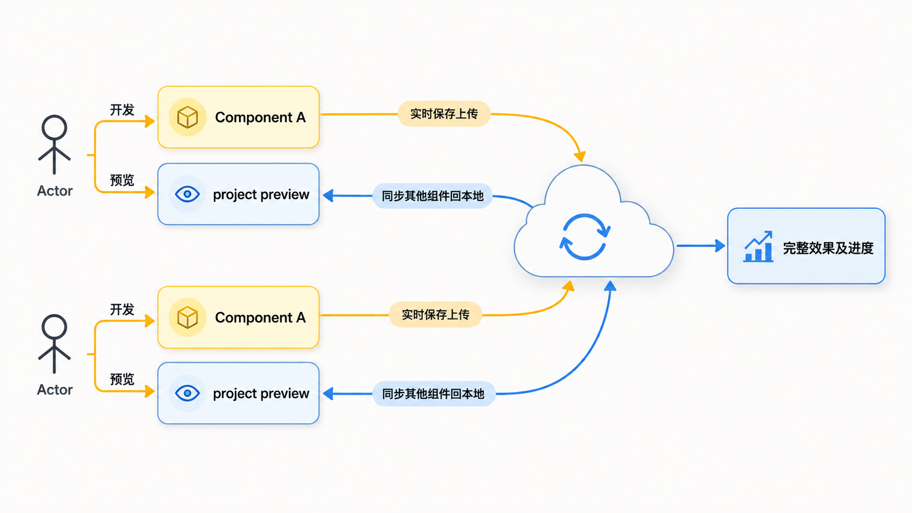

活动研发场景下，整个流程会更重约定。目的是开发者仅需要专注于自己的模块开发，同时也可以看到最终产出的完整效果。这很类似 Figma 的协作模式，而非传统的 Git 分支开发模式。

## Demo 演示

左右两屏代表两个人在同时开发，浏览器预览的是右边的项目。

<VideoEmbed
  src="./parallel-demo.mp4"
  title="并行研发 Demo 演示"
  provider="Garfish"
  duration="02:44"
  description="左右两屏分别代表两个开发者，右侧浏览器预览最终拼装后的页面效果。"
/>

## 目标

<SummaryCards
items={[
{
title: '多人协作提效',
content:
'探索新的开发理念，让活动研发中的多人并行开发真正转化成交付效率。',
},
{
title: '共享依赖体验',
content:
'更方便地使用共享的依赖包、组件库和工具库，让远程模块和本地模块的使用体验保持一致。',
},
{
title: '实时协作链路',
content:
'减少反复发包、装包和切换场景的成本，把协作信息、模块信息同步汇总到平台和开发者本地。',
},
{
title: '复用方案演进',
content:
'在 Git、npm 之外，探索一套更适合快速活动研发的协作和复用方案。',
},
]}
/>

接下来的实现部分和讨论，都是围绕 dev 环境来展开的，需要注意这个上下文。生产环境打包的流程，会在「实现」部分单独介绍。

## 前期思考

这是一个活动页场景下的解决方案，但是提效这个事情，不只是活动场景才有。整个前端开发体系之中，活动场景有的，其他场景也都有，毕竟大家是同一套前端开发体系和技术栈。

既然如此，为何不能够做得更多，让整个方案的设计不局限于活动页场景？

### 当前业务场景开发体验上的困难是什么？

#### 1. 开发状态打断

当我们开发一个需求时，不可避免会想将一些常用逻辑抽象出来，独立为模块以便复用。

这些模块最常见的形态就是将包发到 npm 上，需要使用的人 `npm install` 就够了。但是这里的问题是，在快速开发的时候，发包、装包是一个极其繁琐且容易打断开发思路的问题。

人在高效开发的时候突然被打断，想要回到先前的状态是一个很漫长也很痛苦的事情。并行多线开发的痛苦大家应该都体验过。假如我们能够缩短这个时间和链路，就能够提升一大截效率。

#### 2. 依赖阻塞

依赖阻塞就是当开发某一个功能的时候，需要前置的上下文，可以是一个组件，也可以是一套业务逻辑。如果没有，当前开发就会阻塞。

一般情况下，开发者会自己提前写一个很简陋的实现，无论是固定参数，还是固定样式都行。

这个问题是，前置依赖的更新变化，你是不知道的。假如接口字段和 UI 样式有变动，对当前开发的人来说完全是未知状态。信息沟通不及时的事情太常见了，靠人脑来强制维持这件事，对双方都是一个不小的负担。如果工期很紧张，更是如此。

这也是影响开发效率的一个很重要的因素。

#### 3. 模块的限制

这里的限制是指抽象出来的模块是有限制的。现阶段抽象出来的 package 都是纯的业务逻辑或者功能函数，它是不带静态资源的。

假如要更贴近实际业务场景，这些抽象出来的模块应该允许带静态资源，包括图片、音视频等。

### 什么是好的开发体验？

#### 1. 链路减少以及自动化

前端开发的辅助工具现在很多。当我们去社区或者复用团队内的公用模块时，希望以最少的链路使用，不需要了解其他流程。

理论上，希望做到直接在业务代码中使用其他包。

#### 2. 预览效率

现在的应用大部分都使用 webpack 来打包。当链路减少后，使用这些远程包的时候，如果能避开本地编译流程耗时，在运行时获取，那么这就是最高效的。

## 传统的公共包抽离方案

传统方案是将公共模块抽离，基本上将公共部分独立为一个包。无论是通过 CDN 引入，还是通过 npm 的方式引入，公共模块和实际开发的业务代码都是彻底解耦的。

最简单的模式下，都要经过以下四步：

```tsx
// 1. 实现
export function Component() {
  return <div>content</div>;
}

// 2. 发包
npm publish '@byted/components';

// 3. 装包
npm install '@byted/components';

// 4. 使用
import { Component } from '@byted/components';
```

### 解耦到底好不好？

解耦当然是好的。

解耦能显著地让各个子模块具备更强的原子性，以及更多场景的复用性。这个优势在多人协作、中大型项目开发以及持续迭代中非常有用。

所以新的方案中，这一理念会尽量保留。因此命名为远程模块方案，而不是远程组件方案。

## 传统的共享模块方案

### 1. Webpack MF 方案

MF 方案的好处是，远程模块需要的它都有了，而且整个源码都会经过 webpack 的一层处理，也就是说你能使用同步语法加载需要的模块。

但是缺陷也很明显：

1. 当使用新的模块时，需要重新启动编译。这个过程很繁琐，起码让我自己的开发体验很不舒服。
2. MF 方案在开发和线上统一使用运行时加载去拉取模块。如果应用 A 依赖应用 B 的某一个模块，而应用 B 挂掉了，那么应用 A 就会受到影响。如果这些依赖链很复杂，整个应用链都会受到影响。
3. 同上，MF 利用同步 script 加载，会导致一个 script 加载失败，剩下的就都失败。
4. 缺乏一个类似 npm 的、专门托管模块包的管理中心，使得模块信息格外分散，对于使用体验和提效来说也很糟糕。如果是我，可能还要在这基础上做额外封装，才能让它好用起来。

### 2. 自研 loader 加载器

纯运行时使用自研 loader 去加载远程模块，最致命的缺陷是这些模块的使用一定存在一个 loading 过程。

意思是你一定会有一个 `await`。这会导致整个应用的开发流程都被污染成异步流程。一些第三方库如果不支持异步流程，你将没法使用这些库。

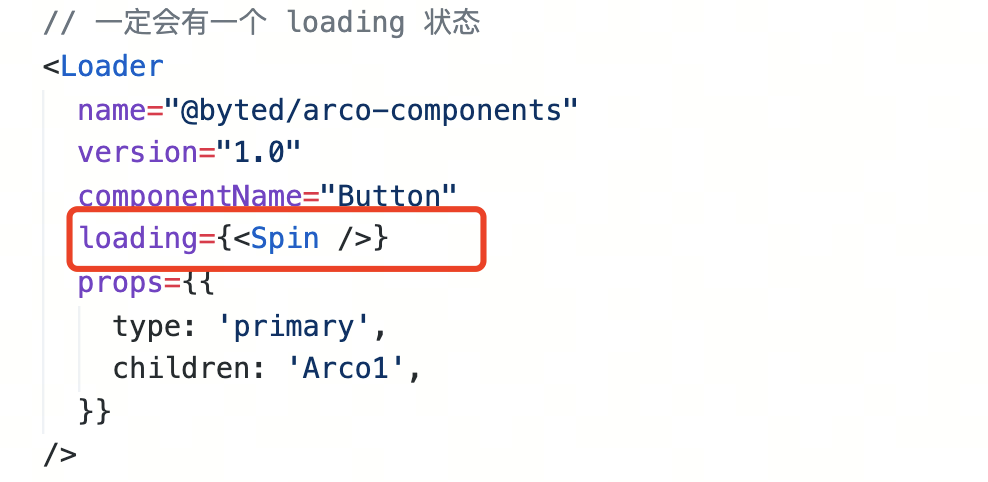

## 解决思路

上面提了一些开发体验上的困难，也介绍了我们认为什么是好的开发体验，以及一些常用的公共模块抽离方案。

在此可以简单回答：我们的解决思路是什么？

<SummaryCards
items={[
{
title: '缩短使用链路',
content:
'去掉发包、装包流程，依然能够使用远程 package，让开发者少处理和业务无关的流程。',
},
{
title: '保持同步语法',
content:
'用户层面仍然用同步语法消费远程模块，兼容已有生态，不污染现有开发模式。',
},
{
title: '运行时拉取源码',
content:
'让远程模块脱离本地 webpack 编译流程，提高预览效率，也方便直接调试子模块。',
},
{
title: '补齐类型体验',
content:
'实时拉取 TS 类型文件到本地，让远程模块也能参与 IDE 提示和类型检查。',
},
{
title: '开放原子能力',
content:
'沉淀推包、拉包、打包等原子能力，必要时开放 API，兼容更复杂的业务场景。',
},
{
title: '区分两套流程',
content:
'开发和生产各自使用独立实现，并在插件内部保证语义一致，兼顾旧项目兼容和性能边界。',
},
]}
/>

## 设计

设计目标主要有两个：

1. 链路缩短以及自动化。
2. 预览效率提升。

### 避免干扰性能

我们的目标是开发提效，有点类似 Vite 的意思。不是功能上类似，而是目标类似，都是为了帮助开发者用得更爽。

极致的性能优化，在生产阶段才有意义。开发阶段的优化重点应该着重放在开发体验上。

所以采取的是和 Vite 类似的思路：走两套打包流程，开发环境一套，生产环境一套。不同的是，我们这两套打包流程都是走 webpack 这同一个打包工具，这也让我们的产物在两套环境上能够保持 100% 相同的语义。

为什么要走两套打包流程？

原因在于我们希望生产环境的包和旧有的打包方式保持一致，这样旧有项目的优化措施就能无缝迁移过来，而且新的远程模块方案带来的性能开销不至于带到生产环境中去。

这种设计也恰好降低了中心包托管平台的压力。

### 按需引入和同步引入

为了使用同步语法加载远程模块，需要提前分析依赖，提前将所需要的资源拉取，然后再去执行业务代码。

有以下两个问题需要解决：

1. 哪些模块是首屏需要的？
2. 如何分析依赖最省时间？

第一个问题的答案：首屏需要的模块就是同步引入的模块。这个很好理解，如果业务代码中不需要使用同步语法加载，那就没有必要提前拉取资源。

第二个问题的答案：由于我们的应用限制在 webpack 打包容器之中，那当然可以借助 webpack 来分析源码，找出用到的依赖。

但是，还有依赖的依赖。远程模块的拉取都放到了 runtime 阶段执行，如果在 runtime 阶段分析拉取的源码，这是一个非常慢的操作。

所以一个好的做法是，将远程模块用到的其他远程模块依赖提前分析，并放置到源码中。这样在当前应用中，直接取就好了。

在 webpack `processAssets` 钩子里面给当前模块注入相关信息，以便运行时框架能够拿到这些信息。这也是为什么，远程模块的开发和打包都要统一使用同一个 webpack 插件。

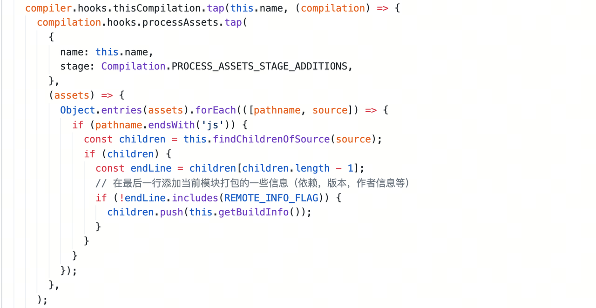

打包产物注入的信息预览：

```json
{
  "name": "m1",
  "author": "chentao.arthur",
  "version": "1.0.0",
  "deps": ["/module/m2/dist/index.js"]
}
```

## 远程模块的拉取

远程模块的拉取主要分为两块：

1. 运行时的模块内容。
2. 开发体验层面上的类型文件。

运行时的模块放到 runtime 阶段，在浏览器中通过 `fetch` 拉取。这样每个模块都是独立拉取的，可以在运行时随意替换。当某个模块的开发者需要嵌入到某个页面中调试时，直接替换模块请求就行。

另一个原因是，我们不喜欢远程模块参与到本地 webpack 编译打包流程。这样能带来一些预览速度上的提升。

### Browser 环境

在运行时动态拉取依赖。开发环境下，不用特意编译成 ES5，只要是 JS 产物就行。

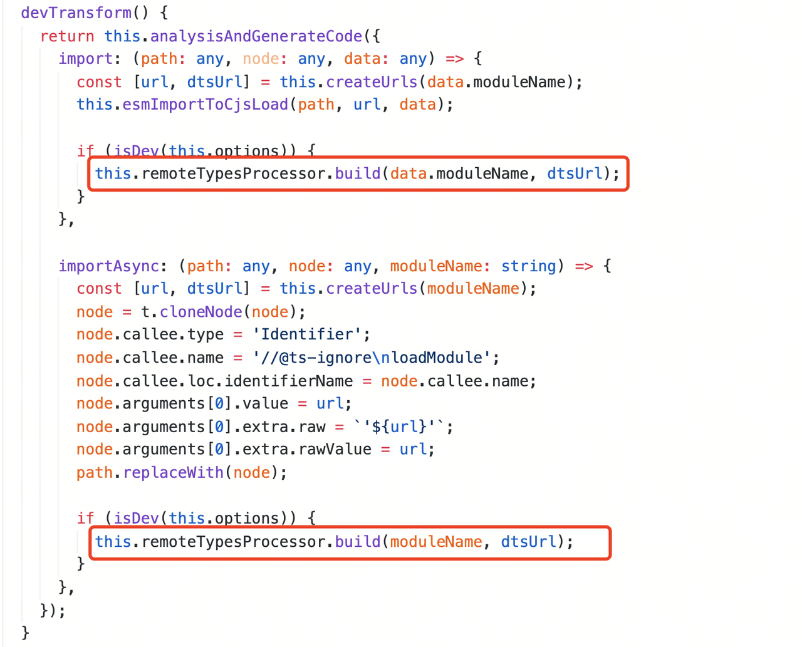

### Node 环境

TS 类型文件放到本地 `node_modules/@types` 之中，这样编辑器里面就会有类型提示。

在 webpack 打包流程中，发现一个远程模块就拉取一个远程模块的类型文件。

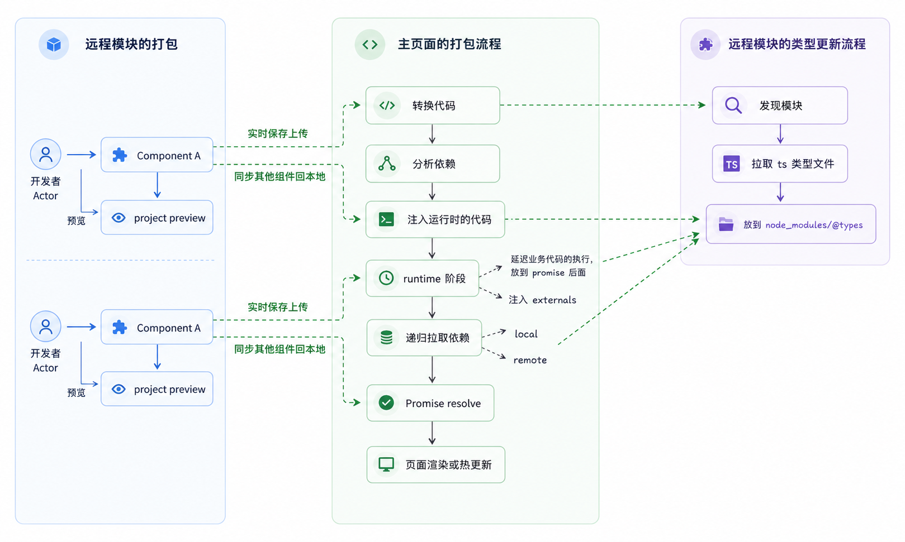

## 实现

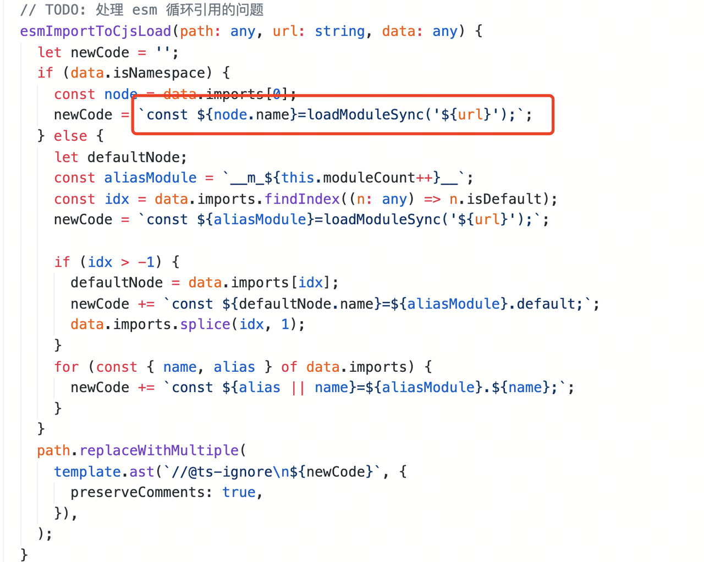

在实现上，我们挑选几个关键的地方说一说。

### 转换代码

将 ES Module 的语法转换成动态的 CJS 模块系统。源码解析是通过 Babel 来做的。

```ts
import m1 from '#m1';

// esm 语法转换成自定义的 loader api 语法
const m1 = loadModuleSync('https://localhost:8000/modules/m1.js').default;
```

这是一个转换器，将 ESM 转换为 CJS 的导出格式。

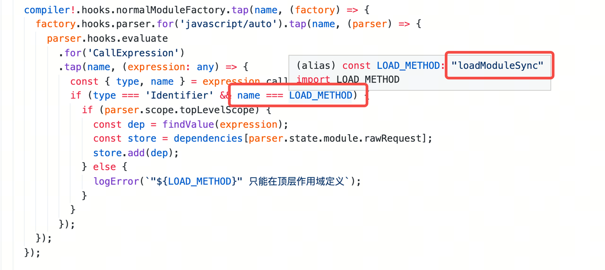

### 寻找依赖

由于 webpack 自带一个 JS parser，就可以遍历生成好的 JS AST 来寻找依赖。`loadModuleSync` 语法是前面转换代码生成的。

这里只需要找到同步加载的模块就行。

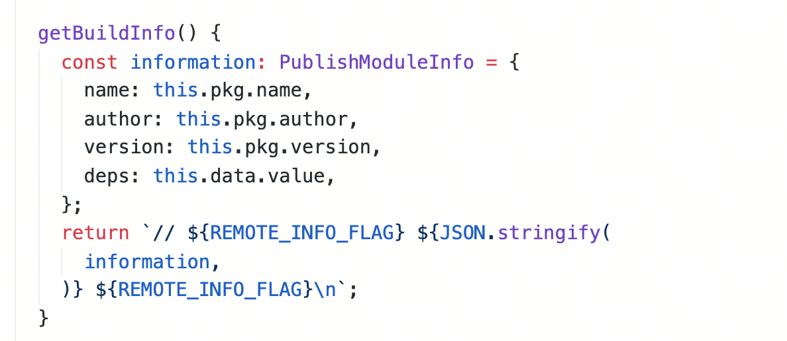

但是上述代码只是将当前应用的依赖收集起来了。远程模块依赖的其他远程模块如何收集？

例如：

```ts
// page
import m1 from '#m1';

// module1
import m2 from '#m2';

// module2
import m3 from '#m3';
```

如果只收集 `m1` 这个依赖，那当加载 `m1` 这个模块时，`m2` 这个模块是没有的，也就没法同步使用。所以当前应用的依赖的依赖也要提前收集。

在运行时动态分析 `m1` 的源码是很耗时的。所以我们在打包这些远程模块的时候，就已经提前将依赖信息分析好，并通过注释的方式注入到源码之中。

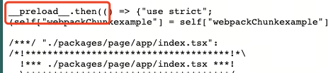

```json
{
  "name": "m1",
  "author": "chentao.arthur",
  "version": "1.0.0",
  "deps": ["/module/m2/dist/index.js"]
}
```

### 注入运行时的代码

运行时的代码有三个作用：

1. 拉取依赖。
2. 延迟业务代码的执行。
3. 注入 externals。

#### 1. 拉取依赖

拉取依赖使用的是 `garfish/remoteModule` 里面自带的加载器。

#### 2. 延迟业务代码的执行

延迟业务代码执行，就是把业务代码放到一个 promise 里面，等依赖拉取完成，promise resolve 掉就好。

在浏览器中运行的产物代码如下。可以看到，所有产物都放到一个 promise 的回调中，这样保证了业务代码层面是同步执行的。

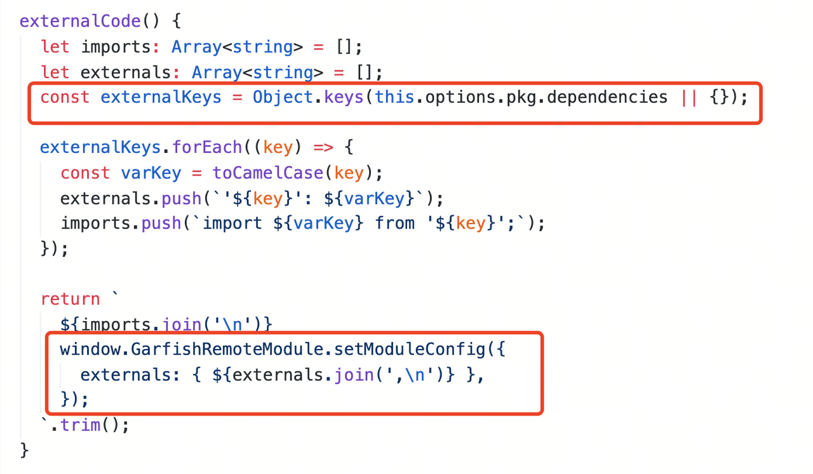

例如下面的 demo。假如没有依赖前置拉取和延迟业务代码执行，只能这样写：

```ts
const m1 = await import('https://x.js');
```

当做了依赖前置拉取和延迟业务代码执行后：

```ts
// 虽然这里 `https://x.js` 是云端资源，需要一个异步加载过程
// 但是代码执行到这里的时候，资源已经提前准备好了。
import m1 from 'https://x.js';
```

#### 3. 注入 externals

注入 externals 就是将当前项目 `package.json` 中 `dependencies` 字段标明的模块注入到 `garfishRemoteModule` 的 external 中，这样子模块里面就能直接使用这些依赖。

remoteModule 的文档可以看这里：https://github.com/modern-js-dev/garfish/tree/master/packages/remote-module

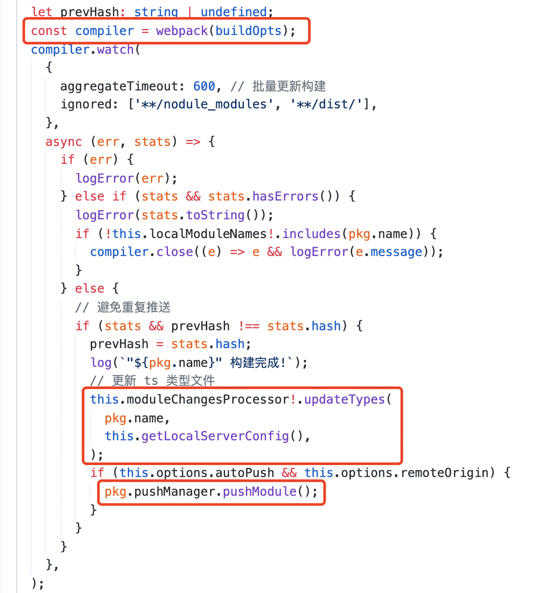

例如宿主环境的 `package.json` 中有 `react` 和 `react-dom`：

```json
{
  "dependencies": {
    "react": "^17.0.2",
    "react-dom": "^17.0.2"
  }
}
```

因为 externals 机制，子模块中可以直接使用这些模块。

```ts
// 子模块代码
import React from 'react';
import ReactDOM from 'react-dom';
```

### 远程模块的打包

远程模块的打包也是使用 webpack。每一个模块都是独立的 webpack 实例打包，然后打包成功后，自动推送到云端。

需要处理的是，在打包过程中分析当前模块的其他远程模块依赖。这里直接复用上面页面寻找依赖的逻辑。之后更新本地的模块类型，自动推送到云端就可以了。

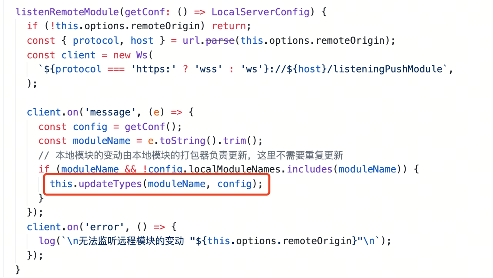

### 类型更新机制

本地 webpack 构建流程启动时，会与云端建立一个 websocket 通信机制。当发现有本地使用的模块在更新时，则同步拉取最新的类型文件，同步到本地 `node_modules/@types` 中。

然后每当云端有模块 push 的时候，如果发现这个 push 的模块正好是本地所使用的，则同步更新类型文件。

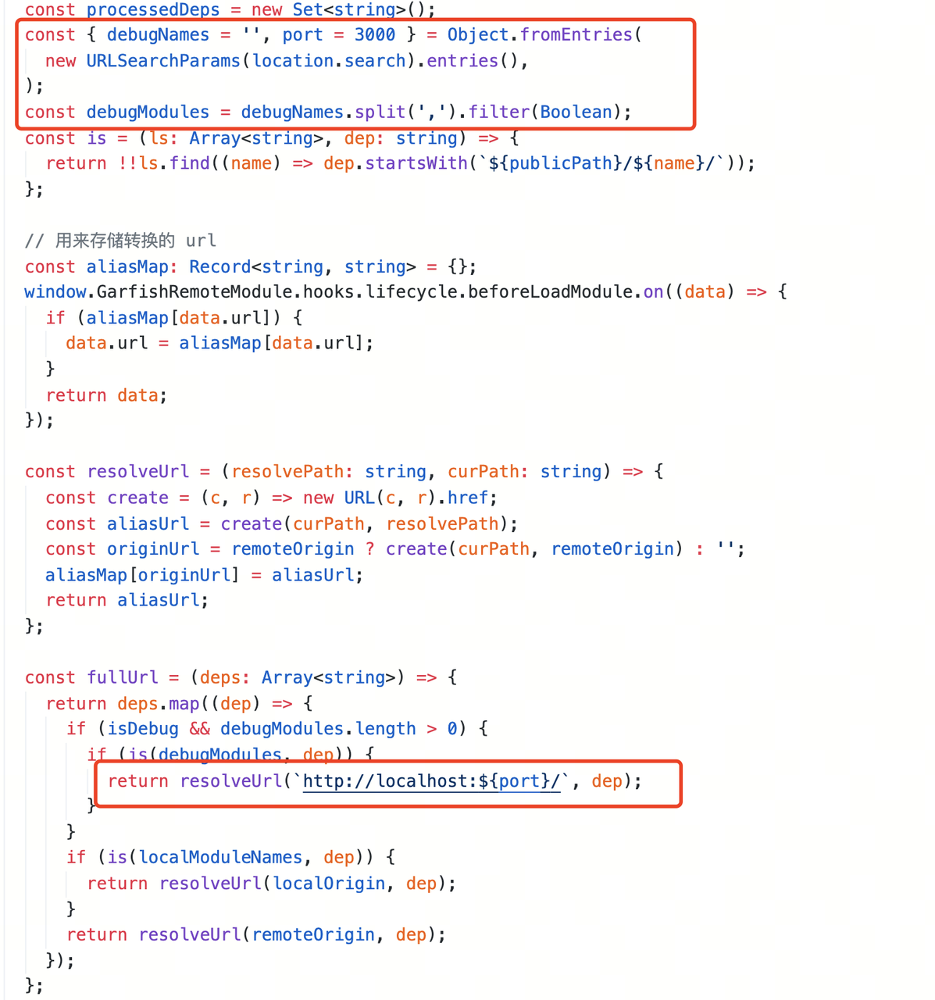

### 如何调试远程模块

远程模块的调试方案有两种。

#### 1. 远程模块独立开发调试

开发者需要自己实现一套调试页面，这块和普通场景一样，就不多介绍了。

#### 2. 远程模块嵌入当前活动页中调试

假如页面是同事 A 在开发，地址是：

```txt
http://10.90.179.26:8002/index.html
```

模块是另外一个同事 B 在开发，模块最终要嵌在页面中，那么模块调试可以像下面这样：

```txt
http://10.90.179.26:8002/index.html?debugNames=A
```

加一个 `debugNames` 就可以调试的原因是：我们注入到浏览器里面的代码做了模块替换操作。

这样就可以使用已有页面调试了，不用代理，不用新建工程，不用配置环境，只要访问其他同学正在开发的页面，就可以调试本地模块。

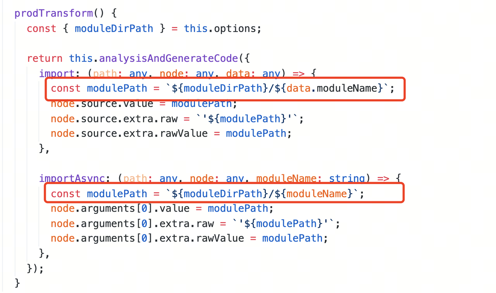

### 生产包的构建

开发流程上，由于我们将开发体验做成和使用本地模块一样，所以做一个假设：

假如这些模块文件真的在本地，那是不是可以说，直接按照旧有模式进行打包就好了？

理论上是这样的，所以现在的打包模块就是将远程模块文件拉到本地，将模块路径换成本地就可以了。例如：

```ts
import m1 from '#m1';

import m1 from './remoteModules/m1';
```

所以，统一两端的语义后，打生产包就格外容易了。

这里的 `moduleDirPath` 就是远程模块拉取到本地的存储容器，这块都是在 webpack 插件内部做的。

## 未来的规划

- 兼容原生 ESM，不再需要通过打包工具来完成，这能够兼容 Unbundled 的打包方案。
- 平台建设，平台能够汇总更多信息，包括接入飞书 API，让开发者能够在项目中完成和其他同事的沟通，也能知道当前项目参与的人和其开发模块的相关信息。
- 定义一套客户端和平台接口协议，以便用户自己搭建和扩展自己的平台。
- 模块之间做一套版本控制系统，以便跨项目复用这些远程模块。
